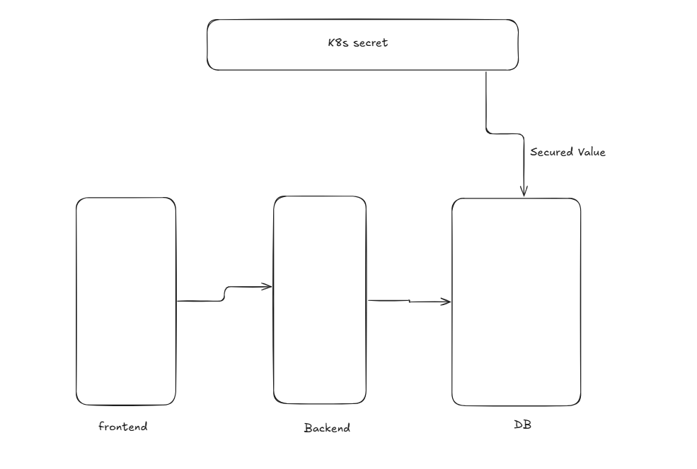

 # Create Base64 encrypt 
 ```
echo -n 'admin' | base64
echo -n 'password' | base64 
kubectl get secret
kubectl exec -it secret-demo -- sh
kubectl apply -f pod.yml
echo -n YWRtaW4= | base64 --decode
```

## Secret Architecture

